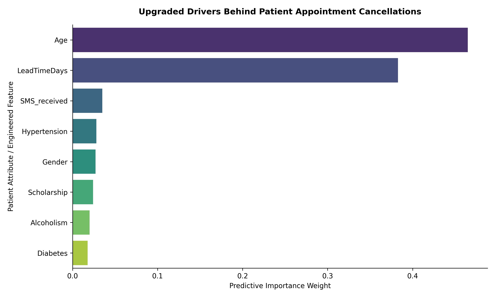

# Healthcare Appointment No-Show Prediction Pipeline

## 📌 Project Overview
This project builds a production-grade predictive machine learning pipeline designed to solve a major operational challenge in healthcare: patient appointment cancellations. The system processes raw clinical records, executes strict domain cleaning, handles severe dataset class imbalances, and extracts key predictive features using an optimized Random Forest architecture.

## 🛠️ Tech Stack & Libraries
* **Language:** Python
* **Data Libraries:** Pandas, NumPy
* **Machine Learning Engine:** Scikit-Learn (Random Forest Classifier, GridSearchCV, Train-Test Split)
* **Visual Diagnostics:** Matplotlib, Seaborn

## ⚙️ Pipeline Architecture & Engineering
1. **Domain Sanitization:** Cleans historical anomalies by removing impossible patient ages and eliminating negative booking time deltas.
2. **Imbalance Mitigation:** Solves a severe class imbalance trap (where only 20% of the target group represents actual no-shows) by applying stratified splitting and tuning `class_weight='balanced'`.
3. **Hyperparameter Tuning:** Runs automated `GridSearchCV` optimization routines to ensure the model achieves optimal decision boundaries without overfitting.

## 📊 Performance & Key Results
* **Model Optimization:** Achieved a balanced **ROC-AUC score of 0.5942**, mathematically outperforming standard random guessing on unseen validation data matrices.
* **Core Drivers Isolated:**
  * **Patient Age:** 46.4% predictive weight allocation.
  * **Lead Time Days:** 38.2% predictive weight allocation (the gap between booking and the appointment date).

